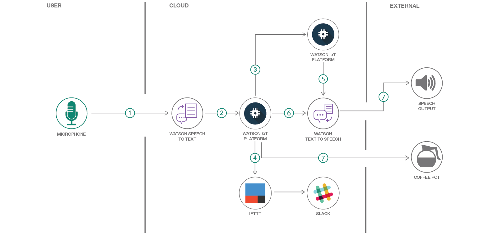
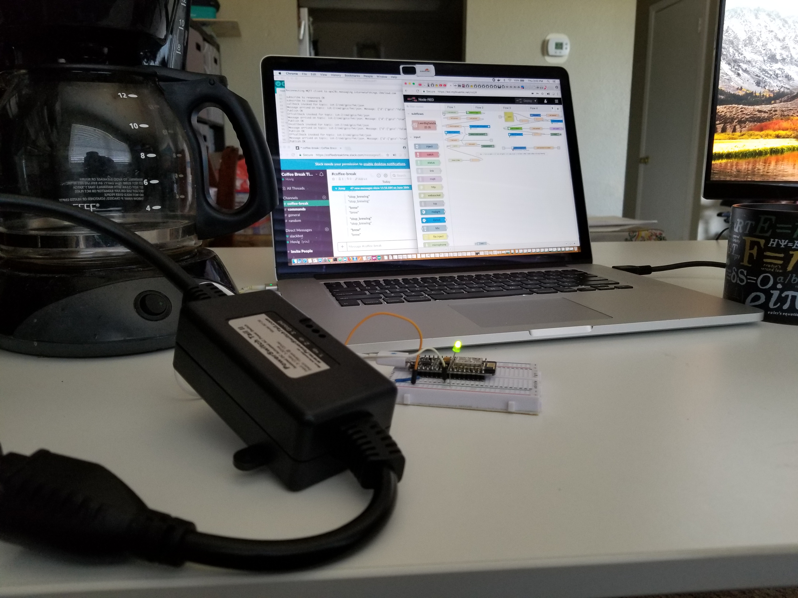

# Coffee Brewing IoT

## Introduction

The idea behind this project is to teach you how to build an IoT application with multiple services to send commands and receive responses through audio conversations using Node-RED Starter and Watson cognitive services. While Audio tends to have its own challenges, this code project should help you address those challenges, and have a little fun along the way.

This project uses the Speech to Text, Text to Speech and IoT Platform services to take an audio sentence and translate it into a command that is sent to a registered device. A registered device is a device that is connected to the IoT Platform and is ready to send topics and receive commands.

While there are a number of devices to choose from, I chose to use a Nodemcu v2 (ESP8266 WiFi-based microcomputer) with MQTT. You can choose to use any other device with mqtt or http communications.

Between the audio sentence and the command process, I’ve implemented IFTTT to Slack messaging. Every time a command is sent to the device, this same command will be displayed on a Slack channel after the command completes, such as brewing coffee or turning on or off an LED light.

Then, IFTTT will trigger events each time there's a request coming from the microphone, and it will be posted on the Slack the specific event made. (I tried to use Amazon Echo to take in commands and send it to IFTTT then to our code (to behave same as the microphone currently in the design), but there's a known issue that it's not recognizing the IFTTT trigger setup.)

If you'd like to watch the videos, I have one video shows how the coffee machine is brewing the coffee after command is sent and the other one does not include the coffee machine but it behaves as if it was there. The reason for the second video is because my hdmi attached screen did not play the sound in the first video.

* [Video with coffee machine](https://youtu.be/JYZVim6CiUw).

* [Video with audio heard](https://youtu.be/zBqWUEjVTzs).

### Before you begin

* Create an IBM Cloud account if you don't have an existing one: [Sign up](https://console.ng.bluemix.net/registration).
* N.B: All services used in this repo are Lite plans. Don't forget to star this repo if you like it.

## TUTORIAL STEPS

* Step 1 - [Create an IBM Cloud app using the Node-RED Starter application.](steps/nodered.md) (microphone & audio player)
* Step 2 - [Add Speech-To-Text service from IBM Cloud Catalog.](steps/stt.md)
* Step 3 - [Add Internet of Things service from IBM Cloud Catalog.](steps/iot.md)
* Step 4 - [IFTTT and Slack setups.](steps/ifttt.md)
* Step 5 - Similar to Step 3, just make sure you have IoT service connected to Node-RED Starter.
* Step 6 - [Add Text-To-Speech service from IBM Cloud Catalog.](steps/tts.md)
* Step 7 - [Back to Node-RED Starter application, as done in Step 1, to make sure that the microphone and the audio are installed & working.](steps/nodered.md)

## Important Naming Notes

* Bluemix aka IBM Cloud

## Useful links

* [IBM Cloud](https://bluemix.net/)  
* [IBM Cloud Documentation](https://www.ng.bluemix.net/docs/)  
* [IBM Cloud Developers Community](http://developer.ibm.com/bluemix)  
* [IBM Watson Internet of Things](http://www.ibm.com/internet-of-things/)  
* [IBM Watson IoT Platform](http://www.ibm.com/internet-of-things/iot-solutions/watson-iot-platform/)   
* [IBM Watson IoT Platform Developers Community](https://developer.ibm.com/iotplatform/)
* [Hovig's Github](https://github.com/hovig?tab=repositories)
* [IBM Watson Tone Analyzer](https://console.bluemix.net/docs/services/tone-analyzer/index.html#tone-analyzer-endpoints)
* [About nodemcu](http://nodemcu.com/index_en.html)

## License
[Apache 2.0](LICENSE)
