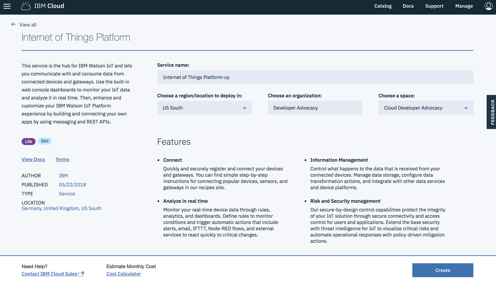
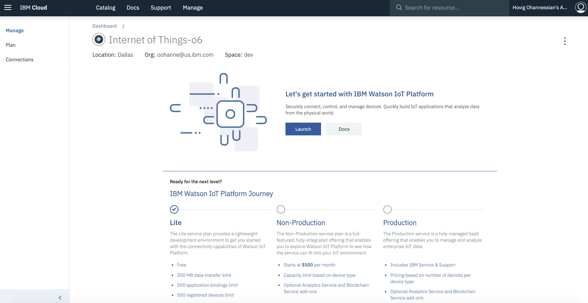
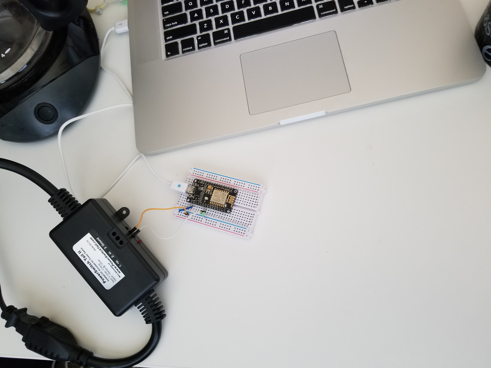
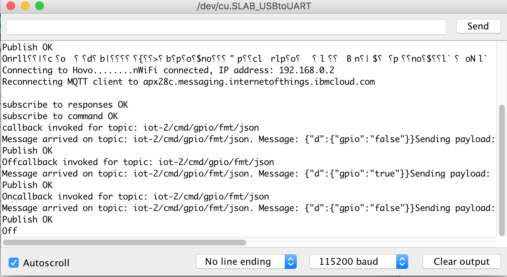

# Internet of Things Platform

The Watson IoT Platform will play multiple roles by taking in the audio and delivering it back, and by sending commands and receiving topics from a hardware device. The published topic will carry out a sentence with it based on a previously sent command.

### Open IBM Cloud Service Catalog:

> [IoT Platform service (not boilerplate) catalog](https://console.bluemix.net/catalog/services/internet-of-things-platform)

After you create the service, open the IoT Platform service and click Launch button:

### How-To:

> Click here to [generate API key and token in IBM Watson IoT Platform](https://developer.ibm.com/code/howtos/iot-generate-apikey-apitoken)

### Hardware

This is Nodemcu version 2 (ESP8266).

> Additional: This is the Serial Monitor from Arduino IDE that shows the connection, the topics, the message, etc.

